```mermaid
graph LR
    A[Data Engineering] --> B[Stream Processing]
    A --> C[Cloud Architecture]
    A --> D[ETL Pipelines]
    B --> E[Apache Kafka]
    C --> F[AWS & Azure]
    D --> G[Airflow & DBT]
    style A fill:#00D9FF,stroke:#00D9FF,color:#000
    style B fill:#1a1a2e,stroke:#00D9FF
    style C fill:#1a1a2e,stroke:#00D9FF
    style D fill:#1a1a2e,stroke:#00D9FF
```

<div align="center">

# 👋 Hey there, I'm Eyad Saleh

### 🚀 Computer Science Senior @ KSIU | Cloud & Data Engineering Enthusiast


</div>

---

## 💫 About Me

```python
class DataEngineer:
    def __init__(self):
        self.name = "Eyad Saleh"
        self.role = "Data Engineering Specialist"
        self.location = "KSIU, Egypt 🇪🇬"
        self.learning = ["PostgreSQL", "Docker", "Kafka", "Airflow"]
        self.interests = ["Data Pipelines", "Cloud Architecture", "Real-time Streaming"]
        
    def say_hi(self):
        print("Thanks for dropping by! Let's build something amazing together! 🎯")

me = DataEngineer()
me.say_hi()
```

- 🔭 **Currently Building:** Scalable data pipelines and cloud-native solutions
- 🌱 **Learning Journey:** PostgreSQL, Docker, Apache Kafka, and modern data stack tools
- ⚡ **Fun Fact:** I can type at **140 WPM** ⌨️💨 (faster than most data streams!)
- 🎯 **2025 Goal:** Master distributed systems and contribute to open-source data projects

---

## 🛠️ Tech Arsenal

<div align="center">

### ☁️ Cloud & Infrastructure


### 📊 Data Engineering & Analytics


### 🔧 Developer Tools


</div>

---

## 📈 GitHub Analytics

<div align="center">
  
  
</div>

<div align="center">
  
</div>

---

## 🎯 Current Focus



---

## 🤝 Let's Connect!

<div align="center">

[](https://www.linkedin.com/in/eyad-saleh-810a1a293/)
[](mailto:eiad222101239@ksiu.edu.eg)
[](https://github.com/marrowdust)

</div>

---

<div align="center">

### 💭 Quote of the Day


### 🎵 Fun Zone
**Coding Soundtrack:** Building data pipelines while listening to lo-fi beats 🎧

**Current Status:** `while(learning) { code(); innovate(); repeat(); }`

---


**⭐ From [marrowdust](https://github.com/marrowdust) with passion for data engineering!**

</div>
