<div align="center">

# Hi, I'm Eyad Saleh 👋

### Computer Science Senior @ KSIU | Passionate About Cloud & Data Engineering


</div>

---

## 💫 About Me


```python
class DataEngineer:
    
    def __init__(self):
        self.name = "Eyad Saleh"
        self.role = "Data Engineering Specialist"
        self.location = "KSIU, Egypt 🇪🇬"
        self.education = "Computer Science Senior"
        
    def current_focus(self):
        return {
            "learning": [
                "PostgreSQL",
                "Docker & Kubernetes", 
                "Apache Kafka",
                "Data Orchestration"
            ],
            "passionate_about": [
                "Building ETL Pipelines",
                "Cloud Architecture",
                "Stream Processing",
                "Distributed Systems"
            ]
        }
    
    def skills(self):
        return {
            "cloud": ["AWS", "Azure"],
            "databases": ["PostgreSQL", "SQL"],
            "tools": ["Docker", "Kafka", "Git"],
            "languages": ["Python", "C++", "Bash"]
        }

    def fun_fact(self):
        return "I type at 140 WPM ⚡ Faster than data streams!"

me = DataEngineer()
print(me.current_focus())
```

<br clear="right"/>

---

## 🛠️ Technical Arsenal

<div align="center">

### ☁️ Cloud & Infrastructure


### 📊 Data Engineering & Analytics


### 🔧 Developer Tools


</div>

---


## 🎯 What Drives Me

```mermaid
graph LR
    A[Data Engineering Passion] --> B[Stream Processing]
    A --> C[Cloud Architecture]
    A --> D[Pipeline Orchestration]
    B --> E[Apache Kafka<br/>Real-time Data]
    C --> F[AWS & Azure<br/>Scalable Infrastructure]
    D --> G[ETL Workflows<br/>Data Transformation]
    
    style A fill:#00D9FF,stroke:#00D9FF,color:#000,stroke-width:3px
    style B fill:#1a1a2e,stroke:#00D9FF,stroke-width:2px
    style C fill:#1a1a2e,stroke:#00D9FF,stroke-width:2px
    style D fill:#1a1a2e,stroke:#00D9FF,stroke-width:2px
    style E fill:#16213e,stroke:#00D9FF
    style F fill:#16213e,stroke:#00D9FF
    style G fill:#16213e,stroke:#00D9FF
```

<div align="center">



</div>

### 🚀 Current Mission

<div align="center">

**Building Scalable Data Solutions** | **Cloud-Native Architecture** | **Real-Time Processing**


</div>

#### 🎯 Short-Term Goals
- Master PostgreSQL query optimization and indexing strategies
- Build production-ready Apache Kafka streaming pipelines  
- Deploy containerized data workflows with Docker & Kubernetes

#### 🌟 Long-Term Vision
- Architect enterprise-scale distributed data platforms
- Contribute to open-source data engineering projects
- Become an expert in cloud-native data systems

> *"Turning complex data challenges into elegant, scalable solutions ✨"*

---

## 🌟 Fun Facts & Interests

 **Speed Typist:** 140 WPM typing speed - I process data fast in code AND in real life!

 **Philosophy:** *"Data is the new oil, but without proper pipelines, it's just crude."*

 **Current Vibe:** Building systems that scale, one container at a time 🐳

---

## 📫 Let's Connect & Collaborate!

<div align="center">

[](https://www.linkedin.com/in/eyad-saleh-810a1a293/)
[](mailto:eyadsaleh.de@gmail.com)
[](https://github.com/RustyyES)


### 💼 Open to opportunities in Data Engineering & Cloud Architecture

*"Let's build something amazing together!"*

</div>

---

<div align="center">


**⭐ Thanks for visiting! If you like what you see, let's connect!**

</div>
